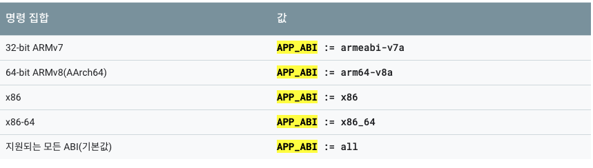

# Android NDK Guide
NDK는 Android에서 C 및 C++ 코드를 사용할 수 있게 해주는 일련의 도구 모음

## Project Structure
- hello-jni: [Sample]Basic Sample about how to use JNI
- JNI: [GUIDE]Guide of JNI Grammar
- NDK_Build: [Build]Build Native Shared Library

## NDK 및 도구
앱의 Native code를 컴파일하고 디버깅하기 위한 구성요소
- <b>Android NDK(Native Development Kit)</b>  Android에서 C 및 C++ 코드를 사용할 수 있도록 해주는 도구 모음
- <b>CMake</b>  
Gradle과 함께 작동하여 Native Library를 빌드하는 외부 빌드 도구
ndk-build만 사용시 필요하지 않음
- <b>LLDB</b> 
Android studio에서 네이티브 코드를 디버깅 하는데 사용하는 디버거

## NDK 프로젝트 빌드
NDK로 코드를 빌드하는 방법에는 3가지 방법이 존재 
- Make 기반 ndk-build
- CMake
- 독립 실행형 도구 모음

### Make 기반 ndk-build
https://developer.android.com/ndk/guides/ndk-build

### CMake
https://developer.android.com/ndk/guides/cmake
## Application.mk
선택적으로 타겟 ABI, 툴체인, 릴리스/디버그 모드, STL을 구성하는 파일

### 변수
- APP_ABI: ABI용 코드를 생성

- APP_PLATFORM: 애플리케이션이 빌드된 Android API 레벨을 선언, 애플리케이션의 minSdkVersion에 해당, 예를들어 android-16은의 값은 라이브러리가 Android 4.1(API 레벨 16)미만에서는 이용할 수 없는 API

## Android.mk
JNI 에 이름, 플래그, 연결 라이브러리, 컴파일할 소스 파일을 비롯하여 Native Library를 설명하는 파일
### NDK에서 정의한 include 변수
- BUILD_SHARED_LIBRARY: 대상 공유 라이브러리의 빌드 방법을 결정

### 모듈 설명 변수
- LOCAL_MODULE: 모듈의 이름을 저장. 모든 모듈 이름 중에서 고유해야 하며 공백을 포함하면 안됨. lib 접두사 또는 .so나 .a파일 확장자를 추가할 필요가 없으며 빌드 시스템에서 자동으로 수정
- LOCAL_SRC_FILES: 빌드 시스템에서 모듈을 생성하기 위해 사용하는 소스 파일의 목록을 포함
- LOCAL_C_INCLUDES: 모든 소스(C, C++, 어셈블리)를 컴파일할 때 포함 검색 경로를 추가하기 위해 이 선택적 변수를 사용

### NDK에서 제공하는 함수 매크로
$(call <function>)을 사용하여 매크로를 사용
- my-dir: 현재 Android.mk의 디렉토리
- CLEAR_VARS: LOCAL_MODULE, LOCAL_SRC_FILES, LOCAL_STATIC_LIBRARIES와 같은 많은 LOCAL_XXX 변수를 자동으로 삭제하는 특수한 GNU Makefile을 가리킴 하지만 LOCAL_PATH는 삭제하지 않음

#### 용어 정리
- Native Shared Library: NDK에서는 개발자의 C/C++ 소스 코드에서 이러한 라이브러리 또는 .so파일을 빌드
- Native Static Library: NDK에서는 개발자의 다른 라이브러리에 연결할 수 있는 정적 라이브러리 또는 .a파일을 빌드
- ABI(Android Binary Interface): ABI앱의 기계어 코드가 런타임 시 시스템과 어떻게 상호작용할지를 정확히 정의. NDK는 이 정의에 따라 .so파일을 빌드, 다양한 ABI는 서로 다른 Architecture에 대응. 즉, NDK에는 32비트 ARM, AArch64, x86, x86-64용 ABI지원이 포함되어 있습니다.